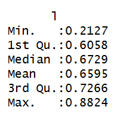
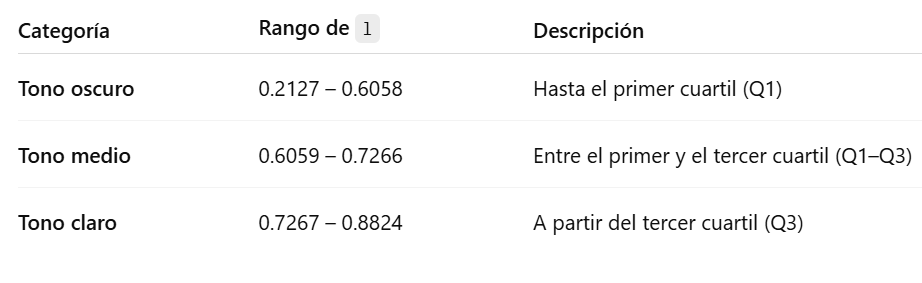

# Tarea 2 "Análisis de tonos de piel en portadas de Vogue"

## Descripción

El presente trabajo busca mostrar la representación de tonos de piel en portadas de Vogue entre los años 2000 y 2018, utilizando la variable de luminosidad (l) derivada de la base de datos faces.csv, la cual fue extraída del GitHub de "The pudding". La variable l toma valores entre 0 y 1, donde 0 representa el negro absoluto y 1 el blanco, capturando así el nivel de brillo promedio del rostro detectado en cada portada.

## 1. Librerías necesarias

``` r
library(tidyverse)
library(lubridate) 
library(ggplot2) 
library(readr) 
library(dplyr)
```

## 2. Carga base de datos orginal

``` r
df_original <- read_csv("C:/Users/avrom/OneDrive - Universidad Católica de Chile/2. Magister CP Gobierno y PP/Análisis magister/1. Tareas/Tarea2_vogue/faces.csv")
```

La base de datos utilizada (`faces.csv`) proviene del proyecto "The Pudding" un medio de periodismo visual que combina narrativas, datos y diseño interactivo para explorar fenómenos culturales contemporáneos.

## 3. Exploración inicial de luminosidad

La finalidad de este proyecto es visualizar la distribución de los tonos de piel de las modelos que han aparecido en las portadas de Vogue entre los años 2000 y 2018. El objetivo es identificar posibles patrones o sesgos en la representación visual, a partir de una clasificación en tres categorías de tono de piel: oscuro, medio y claro.

La base de datos original no incluye una variable categórica que describa el tono de piel; sin embargo, contiene la variable de luminosidad (l), que representa el nivel de claridad de cada rostro en una escala continua de 0 (negro absoluto) a 1 (blanco absoluto). A partir de esta variable, se decidió construir una clasificación empírica de los tonos de piel en función de los cuartiles de la distribución de luminosidad.

Este enfoque permite segmentar los valores según la composición real de la muestra, evitando el uso de umbrales arbitrarios y asegurando una clasificación relativa y adaptada a los datos observados.

summary(df_original)

-   **Los valores entregados por este comando, fueron:**



-   De este modo, según esta clasificación las categorías resultantes fueron las siguientes:



### **Validación empírica del punto 3**

Se revisaron los valores extremos para asegurar que la clasificación reflejara adecuadamente los tonos de piel. Los resultados muestran coherencia entre los valores de luminosidad y los tonos de piel reales:

1.  **Extremo infoerior (luminosidad baja: pieles más oscuras)**

Se seleccionaron las observaciones con los valores más bajos de `l`:

``` r
df_original |> 
arrange(l) |> 
select(model, l) |> 
head(10)
```

Tras este comando, se muestra que Lupita Nyong’o, Michelle Obama, Serena Williams, Beyoncé, Halle Berry corresponden efectivamente a modelos con piel oscura, validando el extremo inferior de la escala.

2.  **Extremo superior (luminosidad alta: pieles más claras)**

Se repitió el procedimiento en sentido inverso:

``` r
df_original |> 
arrange(desc(l)) |> 
select(model, l) |> 
head(10)
```

A partir del comando Anne Hathaway, Jessica Chastain, Amy Adams, Natalia Vodianova, Keira Knightley corresponden a modelos de piel clara, confirmando la validez del extremo superior.

## 4. Preparar y limpiar los datos

Conservaremos solo las variables necesarias (date y l), ya que model (nombre de las modelos) no se necesita para el análisis temporal y tone no es relevante porque se tiene otra clasificación para el análisis

1.  **Seleccionar solo las columnas necesarias**

``` r
df_nuevatabla <- df_original |>
select(date, l)
```

2.  **Convertir fecha y extraer el año**

``` r
df_nuevatabla <- df_nuevatabla |>
mutate(year = year(mdy(date))) |>
select(-date)
```

3.  **Crear categorías de todo de piel según cuartiles de luminosidad**

Al inicio se generó la explicación de la clasificación

``` r
df_nuevatabla <- df_nuevatabla |> 
 mutate( tono_piel = cut( l, breaks = c(0.2127, 0.6058, 0.7266, 0.8824), labels =   c("Oscuro", "Medio", "Claro"), include.lowest = TRUE ) )
```

4.  **Agrupar por año y categoría de tono**

``` r
df_nuevatabla <- df_nuevatabla |>
 group_by(year, tono_piel) |>
  summarise(cantidad = n(), .groups = "drop")
```

5.  **Ver tabla resumen**

``` r
head(df_nuevatabla)
```

## 5. Visualización de datos 1: Evolución temporal por tono de piel

Gráfico de líneas que muestra cómo varía la cantidad de modelos por tono de piel en las portadas entre 2000 y 2018:

``` r
tiempo <- ggplot(df_nuevatabla, 
                 aes(x = factor(year), 
                     y = cantidad, 
                     color = tono_piel, 
                     group = tono_piel)) +
  geom_line(size = 1.2) +
  geom_point(size = 3) +
  scale_color_manual(values = c(
    "Oscuro" = "#8B3A62",
    "Medio"   = "#CD6090",
    "Claro"   = "#FFC0CB"
  )) +
  scale_y_continuous(breaks = seq(0, 16, by = 2)) +
  scale_x_discrete(breaks = seq(2000, 2018, by = 2)) +
  labs(
    title = "Evolución de tonos de piel en portadas de Vogue (2000–2018)",
    subtitle = "Número de modelos por categoría de tono de piel",
    x = "Año de publicación",
    y = "Cantidad de modelos en portadas",
    color = "Tono de piel"
  ) +
  theme_minimal(base_size = 12) +
  theme(
    plot.title = element_text(face = "bold"),
    legend.position = "bottom"
  )
```

Ante esta codificación, resulta el siguiente gráfico:

ADJUNTAR GRÁFICO

## 6. Visualización de datos 2: Gráfico de barras por porcentaje

Además del análisis basado en cantidades absolutas, se genera un gráfico que muestra la proporción (%) que representa cada categoría de tono de piel en las portadas de Vogue por año. Para ello, primero se calcula el porcentaje que corresponde a cada categoría dentro de cada año.

1.  El siguiente código **agrupa los datos por año y calcula el porcentaje** que representa cada categoría respecto del total de modelos publicadas ese año:

``` r
df_porcentaje <- df_nuevatabla |> 
  group_by(year) |> 
  mutate(porcentaje = cantidad / sum(cantidad) * 100)
```

2.  **Códigos para gráfico de barras apiladas por porcentaje**

``` r
porcentaje <- ggplot(df_porcentaje, 
                     aes(x = factor(year), 
                         y = porcentaje, 
                         fill = tono_piel)) +
  geom_bar(stat = "identity", position = "stack") +
  geom_text(
    aes(label = paste0(round(porcentaje, 1), "%")),
    position = position_stack(vjust = 0.5),
    color = "white",
    size = 3,
    family = "Arial"
  ) +
  scale_fill_manual(values = c(
    "Oscuro" = "#8B3A62",
    "Medio"  = "#CD6090",
    "Claro"  = "#FFC0CB"
  )) +
  labs(
    title = "Proporción de tonos de piel en portadas de Vogue (2000–2018)",
    subtitle = "Porcentaje de representación por año",
    x = "Año de publicación",
    y = "Porcentaje (%)",
    fill = "Tono de piel"
  ) +
  theme_minimal(base_size = 12) +
  theme(
    text = element_text(family = "Arial"),
    plot.title = element_text(size = 13, face = "bold", hjust = 0.5),
    plot.subtitle = element_text(size = 10, hjust = 0.5, color = "gray30"),
    axis.title.x = element_text(size = 10),
    axis.title.y = element_text(size = 10),
    axis.text.x  = element_text(size = 8, angle = 45, vjust = 0.7),
    axis.text.y  = element_text(size = 8),
    legend.title = element_text(size = 9),
    legend.text  = element_text(size = 8),
    legend.position = "bottom"
  )
```

## Conclusión  

Consideraciones metodológicas

Este método no busca establecer una tipología universal de tonos de piel, sino representar cómo se distribuyen dentro del universo de portadas de Vogue.

Dado que la muestra presenta una sobrerrepresentación de pieles claras, las categorías deben interpretarse como relativas a este contexto.

La clasificación está sujeta a variaciones por iluminación y condiciones fotográficas, aunque los valores extremos se mantienen consistentes.
